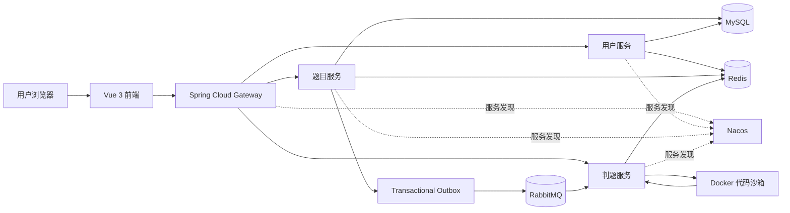

# YUOJ 在线代码练习平台

YUOJ 是一个前后端分离、微服务架构的在线代码练习与判题平台。用户可以浏览题目、在线编写并提交代码，系统通过 RabbitMQ 异步分发判题任务，由独立判题服务调用 Docker 代码沙箱完成编译和运行，最终保存并展示判题结果。

本仓库包含 Vue 前端、Spring Cloud 微服务后端和独立代码沙箱三个子项目。

## 核心功能

- 用户注册、登录、会话管理与权限校验
- 题目创建、编辑、检索、分页展示及在线代码编辑
- 代码提交、异步判题、运行结果与资源消耗统计
- 基于 Nacos 的服务注册发现和基于 Gateway 的统一接口入口
- 基于 RabbitMQ 的判题任务解耦、延迟重试与死信收集
- 基于 Docker 的代码隔离执行和多维资源限制

## 系统架构



一次代码提交的主要流程如下：

1. 题目服务在同一数据库事务中保存提交记录和 Outbox 事件。
2. Outbox 发布器定时扫描待发送事件，通过 Publisher Confirm 确认 RabbitMQ 是否接收成功。
3. 判题服务消费任务，通过 `WAITING -> RUNNING` 条件更新抢占提交记录，避免重复判题。
4. 判题服务调用代码沙箱编译、运行代码，并根据输出、时间和内存信息完成判题。
5. 可恢复异常进入 5、10、20 秒三级延迟队列；超过重试次数或消息格式错误时进入 DLQ。

## 可靠消息设计

### 发送端可靠性

- 使用 Transactional Outbox 解决提交记录与 MQ 消息的双写一致性问题。
- 业务数据与消息事件在同一本地事务中落库，避免数据库成功但消息发送失败。
- 后台任务批量扫描 Outbox，通过 Publisher Confirm 判断投递结果。
- 发送失败后使用指数退避重新调度，避免故障期间频繁重试。
- 通过条件更新抢占 Outbox 记录，支持多实例并发发布。

### 消费端可靠性

- 使用提交状态机的条件更新作为幂等门禁，只有成功将状态从 `WAITING` 更新为 `RUNNING` 的消费者才能执行判题。
- 使用手动 ACK，业务处理成功后才确认原消息。
- 重试消息获得 Broker Confirm 后再 ACK 原消息；重试发布失败时重新入队原消息。
- 配置 5、10、20 秒三级延迟重试队列和死信队列，保留不可恢复消息以便排查。

## 代码沙箱安全

代码沙箱使用 `eclipse-temurin:8-jdk-alpine` 镜像执行 Java 代码，并设置以下安全边界：

| 防护维度 | 当前限制 | 主要目的 |
| --- | ---: | --- |
| CPU | 1 核 | 限制计算资源占用 |
| 内存 | 100 MB | 防止内存耗尽 |
| 进程数 | 64 | 防御 Fork Bomb |
| 执行时间 | 5 秒 | 终止死循环和长时间阻塞 |
| 标准输出与错误输出 | 合计 1 MB | 防止输出洪泛 |
| 网络 | 禁用 | 阻止容器主动访问外部网络 |
| 根文件系统 | 只读 | 降低容器内文件篡改风险 |

超时或输出超限后，沙箱会立即终止执行进程或容器；无论编译失败、运行异常还是执行超时，都会在 `finally` 中清理本次提交产生的临时目录。

## 技术栈

| 模块 | 技术 |
| --- | --- |
| 前端 | Vue 3、TypeScript、Vue Router、Vuex、Arco Design、Monaco Editor、ByteMD、Axios |
| 后端 | Java 8、Spring Boot 2.6、Spring Cloud 2021、Spring Cloud Alibaba、OpenFeign |
| 数据访问 | MySQL 8、MyBatis、MyBatis-Plus |
| 中间件 | Redis 6、RabbitMQ 3.12、Nacos 2.2 |
| 网关与文档 | Spring Cloud Gateway、Knife4j |
| 代码沙箱 | Spring Boot、Docker Java 3.3、Docker Engine |
| 工程化 | Maven、npm、Docker Compose、JUnit 5 |

## 项目结构

```text
.
├── yuoj-frontend-master/                 # Vue 3 前端
├── yuoj-backend-microservice-master/     # Spring Cloud 微服务后端
│   ├── yuoj-backend-gateway/             # API 网关，端口 8101
│   ├── yuoj-backend-user-service/        # 用户服务，端口 8102
│   ├── yuoj-backend-question-service/    # 题目与提交服务，端口 8103
│   ├── yuoj-backend-judge-service/       # 判题服务，端口 8104
│   ├── yuoj-backend-common/              # 通用工具与统一响应
│   ├── yuoj-backend-model/               # 公共实体、DTO 与枚举
│   ├── yuoj-backend-service-client/      # OpenFeign 服务接口
│   └── mysql-init/                       # 数据库初始化脚本
└── yuoj-code-sandbox-master/             # Docker 代码沙箱，端口 8090
```

## 本地运行

### 环境要求

- JDK 8
- Maven 3.8+
- Node.js 16+ 与 npm
- Docker Engine 或 Docker Desktop，并启用 Linux 容器

### 1. 启动基础设施

```bash
cd yuoj-backend-microservice-master
docker compose -f docker-compose.env.yml up -d
```

该命令会启动 MySQL、Redis、RabbitMQ 和 Nacos，并通过 `mysql-init` 自动初始化数据库。首次启动需要等待 MySQL 与 Nacos 完成初始化。

常用访问地址：

- Nacos：`http://localhost:8848/nacos`
- RabbitMQ 管理端：`http://localhost:15672`，默认账号和密码均为 `guest`
- 后端统一网关：`http://localhost:8101`

### 2. 构建并启动后端

```bash
cd yuoj-backend-microservice-master
mvn clean install -DskipTests
```

构建完成后，可在 IDE 中依次启动以下应用：

1. `YuojBackendGatewayApplication`
2. `YuojBackendUserServiceApplication`
3. `YuojBackendQuestionServiceApplication`
4. `YuojBackendJudgeServiceApplication`

本地配置默认连接 `localhost` 上的 MySQL、Redis、RabbitMQ 和 Nacos。

### 3. 启动代码沙箱

```bash
cd yuoj-code-sandbox-master
docker pull eclipse-temurin:8-jdk-alpine
mvn spring-boot:run
```

代码沙箱监听 `8090` 端口。判题服务通过 `POST /executeCode` 调用沙箱，请求头 `auth` 需要与服务端约定的密钥一致。

### 4. 启动前端

```bash
cd yuoj-frontend-master
npm install
npm run serve
```

本地联调前，将 `yuoj-frontend-master/generated/core/OpenAPI.ts` 中的 `BASE` 设置为网关地址：

```ts
BASE: "http://localhost:8101"
```

## 测试

判题消息可靠性定向测试：

```bash
cd yuoj-backend-microservice-master
mvn -pl yuoj-backend-question-service -am test \
  "-Dtest=JudgeTaskOutboxPublisherTest" \
  "-Dsurefire.failIfNoSpecifiedTests=false"
mvn -pl yuoj-backend-judge-service -am test \
  "-Dtest=JudgeRabbitMqConfigTest,MyMessageConsumerTest" \
  "-Dsurefire.failIfNoSpecifiedTests=false"
```

代码沙箱测试：

```bash
cd yuoj-code-sandbox-master
mvn test
```

代码沙箱目前包含 PID 配置、超时强制终止、输出上限和异常清理等安全边界测试。真实容器测试需要本机 Docker 服务处于运行状态。

## 后续规划

- 将沙箱鉴权密钥和服务地址迁移到外部配置，避免硬编码。
- 增加 Docker 容器级攻击样例与集成测试。
- 接入可观测性组件，监控 Outbox 积压、判题重试、DLQ 数量和沙箱资源使用。
- 扩展更多编程语言镜像及对应判题策略。
